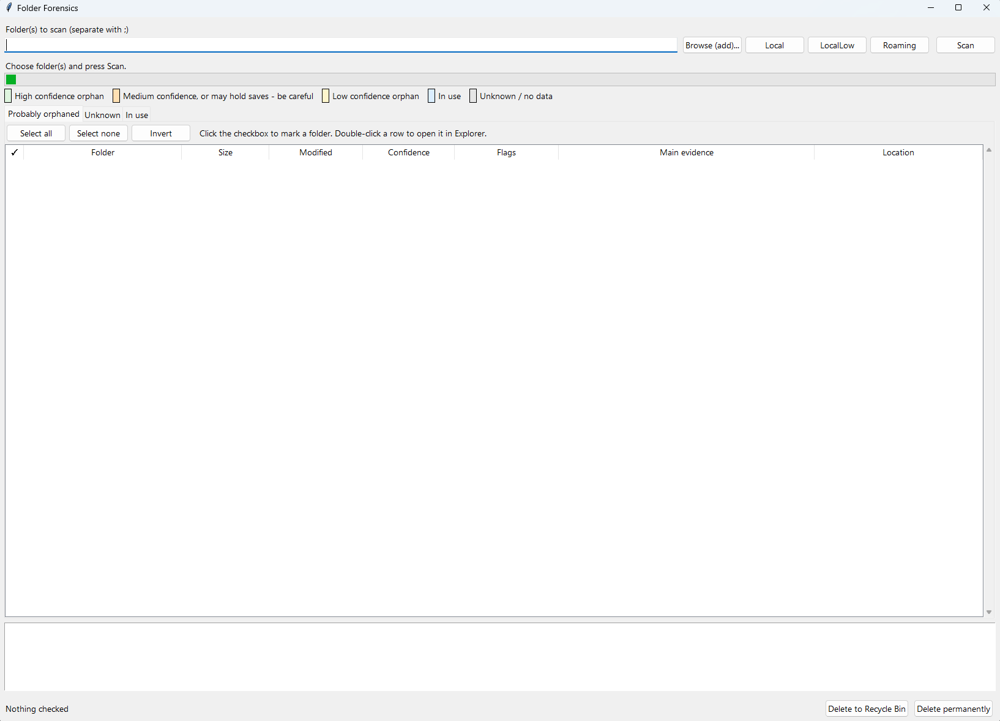

# Folder Forensics

A Windows tool that scans a folder (e.g. `AppData\Local`, `AppData\LocalLow`, `AppData\Roaming`,
or any folder you point it at) and tries to work out, for each subfolder inside it, whether the
program that created it is still installed - by reading evidence that's already on your system
(registry, Steam/Epic/GOG libraries, executable metadata, run history), instead of relying on a
maintained lookup database.

It never deletes anything by itself. It sorts folders into buckets with a confidence level and the
evidence behind it, and you decide what to remove.

## What it does

- **Works on any folder**, not just AppData. Point it at `Local`, `LocalLow`, `Roaming`,
  `ProgramData`, an old game drive, anything. Scan several folders at once by separating paths
  with `;`, or use the Local / LocalLow / Roaming shortcut buttons.
- **Builds its evidence index at scan time** from:
  - Installed-program uninstall registry entries (all hives, including WOW6432Node)
  - Steam (`libraryfolders.vdf` + appmanifests), Epic manifests, GOG registry entries
  - Startup entries (`Run` keys) and `App Paths`
  - Executable version metadata (CompanyName / ProductName) from Program Files and installed apps
  - Unity `app.info` files (exact company/product match for Unity games)
  - Windows run history (UserAssist) - this is what lets it recognise programs that were run in
    the past but have since been uninstalled
  - Windows services (`ImagePath` of every registered service)
  - Scheduled Tasks (`System32\Tasks` XML files - Command and Working Directory)
  - Start Menu shortcuts (all users + current user), resolved to their real target
  - Installed Windows Store / UWP apps (name, package family name, install location) - these are
    the only reliable way to match folders under `LocalAppData\Packages\<PackageFamilyName>`
  - Currently running processes and their full executable paths - the strongest possible "in use"
    signal, and the only one that also catches portable apps with no registry/Start Menu trace
  - BAM (Background Activity Moderator) per-executable last-run timestamps - a second, often more
    complete, run-history source alongside UserAssist. Needs admin rights; skipped quietly if
    unavailable
  - File contents inside each candidate folder (configs/logs), checked for path references that
    still exist vs. no longer exist

  Start Menu / Store app lookups run through a single local PowerShell call (no network access -
  it only queries `WScript.Shell` and `Get-AppxPackage` on your own machine). Everything else is
  read directly via the registry or Windows APIs. No online database, no telemetry, nothing is
  sent anywhere.
- **Classifies every subfolder into three tabs:**
  - **Probably orphaned** - evidence points to a program that's gone, or the folder is empty /
    untouched for 2+ years with no match at all
  - **Unknown** - no evidence either way; a genuine "you decide" bucket
  - **In use** - matches something installed/running, a registered install path, or a protected
    system folder name
- **Confidence + evidence trail.** Every folder gets a High/Medium/Low confidence rating (or a
  flat "in use" / "-" for unknown), and clicking a row shows exactly which piece of evidence
  produced that placement.
- **Color-coded rows** so you can scan a long list at a glance:
  - 🟩 **Green** - high-confidence orphan, safe-looking
  - 🟧 **Orange** - medium confidence, *or* flagged as possibly holding save data - slow down here
  - 🟨 **Yellow** - low-confidence orphan, weaker evidence
  - 🟦 **Light blue** - in use
  - ⬜ **Grey** - unknown, no data either way
- **Checkboxes for selection**, independent of row highlighting. Tick the box next to a folder to
  mark it for deletion; this persists even if you click other rows, switch tabs, or scan more
  folders in between. Per-tab **Select all / Select none / Invert** buttons work on the same
  checkboxes.
- **Double-click** a row, or **right-click → Open in Explorer**, to inspect a folder yourself
  before deciding. The right-click menu also has **Copy full path** and a **Check/Uncheck**
  shortcut.
- **Two ways to delete** what's checked, across all tabs at once:
  - **Delete to Recycle Bin** - reversible
  - **Delete permanently** - skips the Recycle Bin, asks for extra confirmation, cannot be undone
  - Either way you get a confirmation dialog with counts per bucket, and an extra warning if
    anything checked looks "in use" or might hold save data.
- **Safety defaults:** protected system/shared folder names are never flagged as orphaned;
  evidence coming from inside the folder being judged is ignored (so a folder can't "vouch for
  itself"); folders on currently-unplugged drives are treated as in-use rather than orphaned.

## How to run it

- **Normal use:** double-click `FolderForensics.pyw`. No console window, nothing else to install
  (Python's standard library only). If it doesn't open at all, make sure Python is installed and
  associated with `.pyw` files (this is the default on most Python-for-Windows installs).
- **If something goes wrong and you need to see the error:** run `Run (debug console).bat`
  instead - it runs the same file but with a visible console window. Errors are also always
  written to `error.log` next to the script, even in normal double-click mode, so you don't need
  the console just to diagnose a crash.
- **Requirements:** Windows, Python 3.8+. No pip packages needed.

## Known limitations (v1)

- Fuzzy name matching can occasionally mismatch short/generic folder names - always check the
  evidence panel before deleting, especially for Medium/Low confidence items.
- Shimcache/AppCompatCache is not parsed - its binary format varies by Windows build and is
  fragile to parse without a dedicated library, so it's intentionally left out for now. BAM
  covers similar ground when running as admin.
- The Start Menu / Store apps check needs `powershell.exe` on PATH (default on all supported
  Windows versions) and runs one local, non-interactive PowerShell call per scan; if PowerShell
  execution is blocked by policy, that one evidence source is skipped and everything else still
  runs.
- BAM and some service/process lookups need admin rights to read fully; without them those
  sources just contribute less, they don't cause errors.
- Folder size calculation can be slow on very large folders; locked/permission-denied files are
  skipped when sizing and reported individually if deletion fails.
- Recycle Bin deletion can fail on paths beyond ~260 characters; permanent delete still works on
  those.

## Roadmap ideas (not yet built)

- Shimcache/AppCompatCache parsing
- Export current results to CSV/JSON
- Remember checked items / scan settings between runs
- Optional dry-run report before any deletion

---

<strong>Changelog</strong> (click to expand)

### v0.4
- Added a right-click context menu on every row: Open in Explorer, Copy full path,
  Check/Uncheck. Double-click still opens in Explorer too.
- Added five more system-based evidence sources to the index, all local (no network, no
  database): Windows services (`ImagePath`), Scheduled Tasks XML files, Start Menu shortcuts
  (resolved via a local PowerShell/WScript.Shell call), installed Windows Store/UWP apps
  (matches `LocalAppData\Packages\<PackageFamilyName>` folders exactly), currently running
  processes (strongest possible "in use" signal, also catches portable apps), and BAM run-history
  timestamps (admin-only, best effort, skipped quietly otherwise).

### v0.3
- Added checkboxes as the primary selection mechanism (independent of row click/highlight), so
  selections across multiple folders and tabs survive clicking around the UI.
- Added color-coded rows (green/orange/yellow/blue/grey) with an on-screen legend.
- Packaged as a folder with a `.pyw` double-click launcher, a `.bat` debug console launcher, and
  this README.
- Startup errors are now written to `error.log` and shown in a message box instead of silently
  failing when launched without a console.

### v0.2
- Initial working version: evidence index (uninstall registry, Steam/Epic/GOG, startup entries,
  App Paths, executable metadata, Unity app.info, UserAssist run history), three-bucket
  classification with confidence scoring and an evidence trail per folder, generalised to scan
  any folder (not just AppData), Recycle Bin and permanent delete with confirmation dialogs,
  multi-select via Ctrl/Shift-click.

### v0.1
- Initial concept/discussion: registry uninstall-key matching only, single-folder scope.

